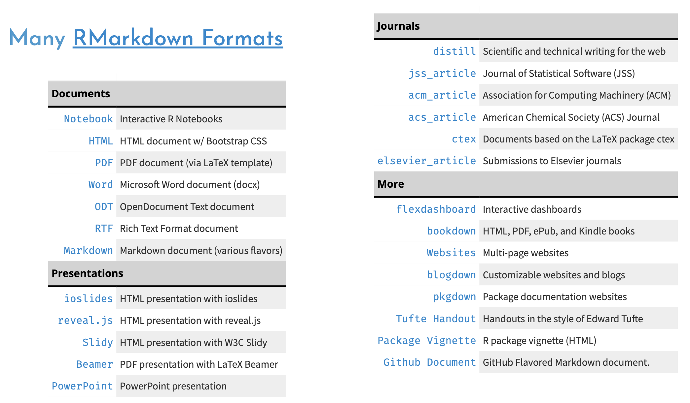

```{r setup, include=FALSE}
knitr::opts_chunk$set(echo = TRUE, warning = FALSE, message = FALSE)
```

## Tell Me about your existing R Markdown projects

-   reports?
-   with templates?
-   with Shiny components?
-   websites?
-   books?
-   data prep scripts?
-   scheduled?
-   how do your share them?

## What is R Markdown?

1.  An authoring framework for data science

2.  A document format (.Rmd)

3.  An R package named rmarkdown

4.  A file format for making dynamic documents with R

5.  A tool for integrating prose, code, and results

6.  A computational document

See <https://rmarkdown.rstudio.com/> and Dr Allison Hill's [Intro to R Markdown](https://rstd.io/rmd4cdc).

## How is R Markdown a strategy?

**R Markdown can be used in different ways to guide you toward solving your research and business problems**

-   **Literate Programming**
-   **Control Documents**
-   **Templating**
-   **Data products**

### Literate Programming

**captures code, prose, and output in a single document enhancing learning and repeatability**

For example, I can use prose to explain the following code chunks:

In this code chunk I am loading the R packages that will be required for my analysis. The tidyverse is an umbrella package of other packages, including the ggplot2 package. I do not have to load ggplot2 explicitly. The previous two sentences would be a bit much for an in-code comment, but are fine for prose located close to the code.

```{r}
library(tidyverse)
```

```{r}
diamonds |>
	ggplot2::ggplot(aes(x = carat, y = price, color = cut)) +
	geom_point(alpha = .3) +
	labs(
		title = "Diamonds: Price as a Function of Carat",
		subtitle = "by cut",
		x = NULL,
		y = NULL
	) +
	theme_minimal()
	
```

**More languages:**\
Literate programming in R Markdown is not just for R. knitr, which computes code in R Markdown, has [many language engines](https://bookdown.org/yihui/rmarkdown/language-engines.html#language-engines). Over 50! Try names(knitr::knit_engines\$get()).

**More reproducible:** Combining comments and documentation with your code increases the chance that others, including future you, will understand your project.

**More exploration:** See [David Robinson's videos](https://youtube.com/playlist?list=PL19ev-r1GBwkuyiwnxoHTRC8TTqP8OEi8) in which he quickly explores data sets using R Markdown documents.

<br>

### Control Documents

**scale data science, automate data tasks, and create data pipelines**

R Markdown can be a meta-document that lets you bring in other code or automate processes.

-   Automation with parameters: such as run a report for state, region, or body of water
-   Child Documents: in once document include the content from another .Rmd
-   Conditional child docs, [see guide](https://bookdown.org/yihui/rmarkdown-cookbook/child-document.html#child-document)
-   ETL in .Rmd, especially when scheduled in Posit Connect
-   RMarkdown for Emails, see [the blastula package](https://github.com/rstudio/blastula)

Let's add content from a child document right here (set eval to TRUE):

<br>

```{r, child=c('loops-example.Rmd'), eval=FALSE}

```

<br>

### Templating

**simplifies and reduces error in important but repetitive production**

Templating through R Markdown templates:

-   standard report layouts
-   standard themes
-   directories
-   load standard libraries
-   share through packages
-   see [more in the guide](https://bookdown.org/yihui/rmarkdown/document-templates.html)

Templating through parameters:

-   Today is `r params$date`
-   see [more in the cookbook](https://bookdown.org/yihui/rmarkdown-cookbook/parameterized-reports.html#parameterized-reports)

Templating through code loops

-   knit the doc loops-example.Rmd

<br>

### Comfortable Data Products

**use R Markdown to compute, report, and deliver findings to colleagues and decision makers**

-   Presentations
-   Dashboards
-   Reports
-   Websites
-   Books
-   Package sites

{width="1920"}

<br>

### Some of the nuts and bolts

**Let's play!**

-   YAML

    -   remove table of contents

    -   add inline R code for the date using Sys.time()

-   Chunk options

-   themes

    -   change html_document to tufte::tufte_html: default

    -   see bslib theme example in directory

-   Add static ggplot2 graph to the flexdashbaord example

-   parameters

    -   regions, states, bodies of water, years

    -   what parameters are you already using?

-   Remember citations ? [@Welcomme2010]

**Here are four incredible resources on the nuts and bolts**

-   [R Markdown: The Definitive Guide](https://bookdown.org/yihui/rmarkdown/)

-   Dr. Allison Hill's [Intro to R Markdown](https://rstd.io/rmd4cdc)

-   Dr. Tom Mock's Higher Faster Further [presentation](https://themockup.blog/posts/2020-07-25-meta-rmarkdown/) and [video](https://youtu.be/WkF7nqEYF1E)

-   NOAA examples: Emily Markowitz's package [NMFSReports](https://emilymarkowitz-noaa.github.io/NMFSReports/index.html) and Dr. Eli Holmes's workshop [R Markdown Reports](https://rverse-tutorials.github.io/RWorkflow-NWFSC-2021/week4.html)

<br>

## Looking ahead to Quarto

-   single framework, you don't need other packages for books, websites, or presentations
-   consistent syntax across types
-   R is not required, you can use Python or Julia or Observable JS natively in Quarto
-   extensible through pandoc extensions
-   [compare to what's available in R Markdown](https://quarto.org/docs/faq/rmarkdown.html#i-use-x-bookdown-blogdown-etc..-what-is-the-quarto-equivalent)

<br>

## Q&A

[code](https://github.com/jeremy-allen/posit-webinar-series)
